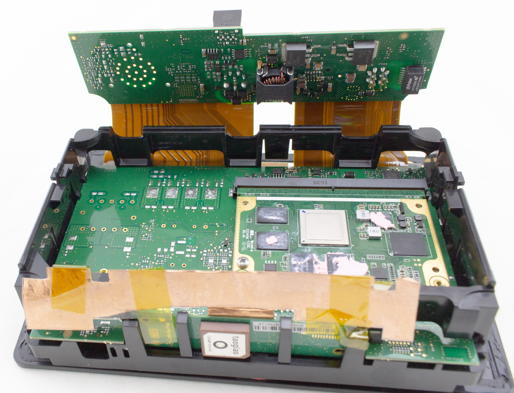
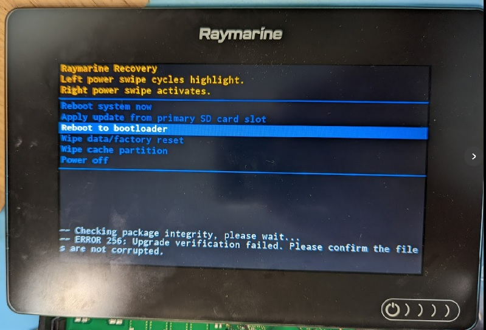
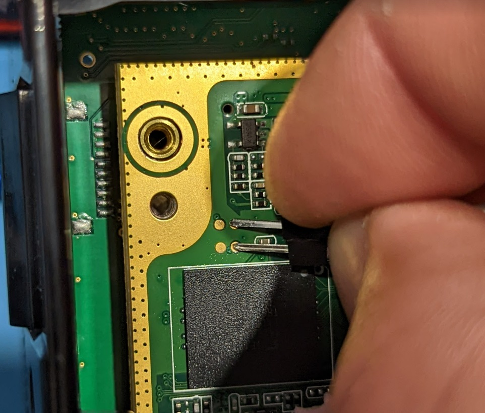
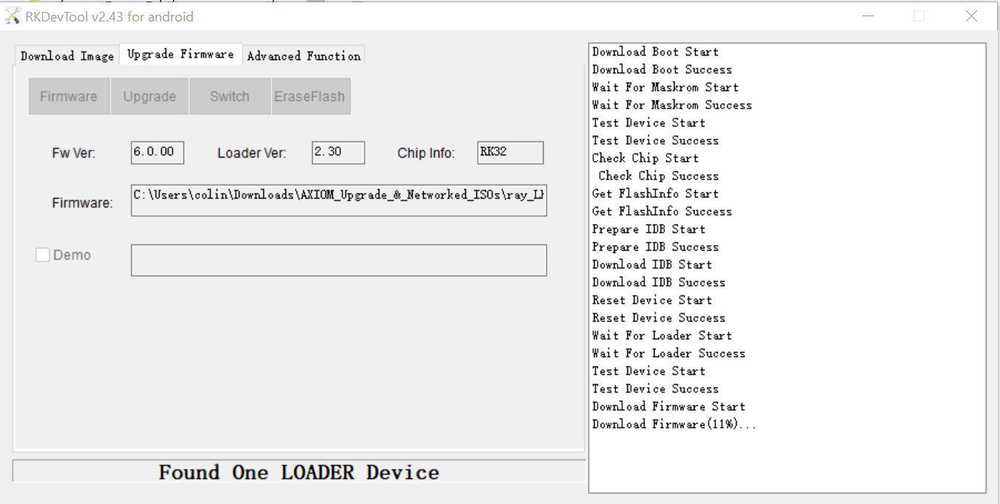

# Axiom Lighthouse - Rooting & Recovery

The information in this repo can be used to recover a unit which has failed to update, or to access additional low-level features.

## Axiom Hardware

The Axiom hardware uses a Rockchip RK3288 as the main processor. An Atmel SAMD handles the button, which can detect (at minimum) right and left swipes.
The main hardware is shown here:



If disassembling the units, the front LCD is attached with glue around the edges. The trickiest part is the touch button - this has a small PCB
which goes much closer to the edge. Typical device disassembly is to:
* Use hot air to loosen glue around edges
* Use a sharp knife to cut around edges, with exception of avoiding the area of the touch button

See photos in this repo for some examples of what to expect.

Be aware the "semi-flex PCB" used for the construction of the Axiom are **not** designed for continous flexing. They typically have a limited (2-3) number of
"allowed" full flex cycles to cover assembly & 1-2 repair attempts. Try to avoid flexing them as much as possible, beyond what is required to remove from the enclosure.

Note that the Sonar parts are NOT present on the PCB if you don't have the sonar option. Thus it's not just the connector missing, but a HUGE section of the
actual PCB parts. This means it is not possible to upgrade a non-sonar unit to a sonar unit.

## Raymarine Lighthouse 4 Exploration

The Axiom Lighthouse 4 update file has a number of `.iso` files - if you extract the one for the MFD units, you'll find a `.img` file. This file
is simply an update in the Rockchip format for the internal RK3288. You can use a tool such as `imgrepackerrk` (described below) to get the actual
system.img file, which you can mount on Linux.

## RockChip Update & Stuff

You'll need to use various resources which explain the Rockchip update process, such as e.g.:
* https://wiki.radxa.com/Rock/flash_the_image
* Tools you can find on e.g. https://github.com/radxa/RKTools

The bootloader can be entered as well allowing regular Rockchip tools to access the device. Watch out if doing this, as you may
erase the Raymarine Bootloader (this won't brick the unit, but it will mean you need to use the USB bootloader tools in the future).

## Adding your own Key for SSH Access

A quick demo of the result of this can be seen in [this YouTube video](https://youtu.be/uBnOP4qZgYk).

The following is the full process I used to add my own SSH key:

### 1. Extract ISO

From the raymarine Lighthouse 4 upgrade file, find the
`ray_LH4_4_00_85_RMK_RVX1000_CPsounders.upgrade.iso` file,
and using 7Zip (or anything else) extract all the files to a folder.

Look into the resulting folder. It has updates for all the various
products - all we need is the single file called "raymarine_axiom_upgrade-4.00.85.img" (you can also download just a
smaller update with only this portion I think).

### 2. Unpack Image

The `raymarine_axiom_upgrade-4.00.85.img` file is an update file in a rockchip specific format. This means we
can use tools for this device to extract the interesting
parts, modify it, and put it back together.

I used a Windows OS tool called [imgrepackerrk](https://forum.xda-developers.com/t/tool-imgrepackerrk-rockchips-firmware-images-unpacker-packer.2257331/):

```
imgrepackerrk raymarine_axiom_upgrade-4.00.85.img
```

This will make a directory called `raymarine_axiom_upgrade-4.00.85.img.dump`. Inside of this
directory has the various files:

```
```

The only one we need to modify is `system.img`.

### 3. Mount `system.img` for editing

If you just want to look around, you can just do the
following to mount the `system.img`:

`sudo mount system.img /some/mnt/point` 

This will only give you read-only access. Dealing with
the squashfs filesystem is more complicated, but luckily
this [stackexchange post](https://unix.stackexchange.com/questions/80305/mounting-a-squashfs-filesystem-in-read-write) has the required commands:
*Note this must be done on a native Linux OS such as an Ubuntu VM.

```
mkdir fm
mkdir to
mkdir temp
mkdir fin
sudo mount system.img fm -t squashfs -o loop
sudo mount -t overlay -o lowerdir=fm,upperdir=to,workdir=temp overlay fin
```

### 4. Copy required files for resigning

We're later going to need to resign our image so it is
accepted by the bootloader. Make a copy of the file
at `fm/bin/raymarine.cgi-bin.com.raymarine_helperUpgrade`.

### 5. Edit SSH keys

Make your own SSH key with:
```
ssh-keygen -t rsa -f my_axiom_key -C root -b 2048
```

I used `nano` and copied `my_axiom_key.pub` to the end of:

```
cat my_axiom_key.pub
sudo nano fin/etc/security/authorized_keys.default
```

Or cat directly to the file to prevent typo as root :
```
cat my_axiom_key.pub >> fin/etc/security/authorized_keys.default
```


### 6. Rebuild `system.img` on Linux VM (squashfs)

Again from the stackexchange post, we need to make a new
squashfs filesystem. First backup the old .img file, then recreate it:

```
mv system.img /somewhere/backup/system.img
sudo mksquashfs fin system.img
``` 

### 7. Repack the RockChip update image

Using imgrepackerrk back on Windows, we'll simply point to the `raymarine_axiom_upgrade-4.00.85.img.dump` folder that it created earlier (and assuming you saved the updated `system.img` directly into it, if not copy if there now):

```
imgrepackerrk "c:\somewhere\AXIOM_Upgrade_&_Networked_ISOs\ray_LH4_4_00_85_RMK_RVX1000_CPsounders.upgrade\raymarine_axiom_upgrade-4.00.85.img.dump"
```

This should overwrite the file `raymarine_axiom_upgrade-4.00.85.img` (make a backup of it first if you want, which might be useful for checking the md5sum etc).


### 8. Update `manifest.xml` - md5sum + size

Open the file `manifest.xml` and find the section with the PN
of the device you want to upgrade. For mine, the E70363 part
is all I care about (you could script this to modify any of them):

```
<Engineering_Part_No>E70363</Engineering_Part_No>
```

**NOTE: See note below, you may wish to simply replace the size/checksum/sig values for all units that share the same image with a global find/replace, so you don't need to worry about the exact engineering PN.**

You'll find three sections that all reference `"http://raymarineupdate.raymarine.com/RaymarineUpgrades/raymarine_axiom_upgrade-4.00.85.img"`, we'll need to update the three fields: `Size`, `MD5_Checksum`, and `SIG_Checksum` so our patched update is accepted.

The first two are easy, run:

```
stat -c %s raymarine_axiom_upgrade-4.00.85.img
md5sum raymarine_axiom_upgrade-4.00.85.img
```

Copy the `size` in bytes to the `Size=` for **all four** components (the first line output). Then copy the `MD5_Checksum=` in the same way.

The final thing needs us to "resign" the file.

### 9. Update `manifest.xml` - signature

The "signature" is luckily a very basic signature which prepends a known secret. We can find this secret in the file `raymarine.cgi-bin.com.raymarine_helperUpgrade`.

The following script will before the required operations, you'll
need to insert the right key in place of "????". You'll also find
this script in the repo.

```
#!/bin/bash
#WARNING: Make sure you don't end up with Windows line-ends (with \r)!! The signature
#will be invalid
MAGIC="?????"
echo "File = $1"
FSIZE="$(stat -c %s $1)"
echo "Size=${FSIZE}"
echo "MD5_Checksum=$(md5sum $1)"
SIG="$(echo -n $MAGIC$FSIZE| cat - $1 | sha256sum - | cut -d' ' -f1)"
echo "SIG_Checksum=${SIG}"
```
Executing the script recommended to use Linux OS like Ubuntu Desktop:

1. Create sig.sh from above
2. make script executable sudo chmod +x sig.sh
3. Run script with image file input value of the original image to validate the key is correct and compare md5sum and signature in the current manifest.md5sum:
4. sudo ./sig.sh raymarine_axiom_upgrade-4.00.85.img
5. Once validated run script on new image file and record the new Size,Md5sum and signature and update manifest.md5sum with find and replace ensuring the values are in "quotes".

I *highly* recommend running the script with the old version of the image file and making sure you get the one that agrees with the manifest file.

If you introduce Windows line-ends it silently causes the script to generate the wrong output. So test it with the known existing file, then go sign your own file.

**NOTE:** You may wish to replace the checksum/md5/size for *all* of the targets using the same image. On a later test it seemed I needed to replace them all for
the update to work - I'm assuming I wasn't updating the correct target when I first tried (maybe it was reading from a different PN as there are several compatable units?). It's easy enough to just do a global replace all, then you know you've gotten all the units.

### 10. Update `manifest.md5sum`

Open `manifest.md5sum`. Insert the md5sum for `raymarine_axiom_upgrade-4.00.85.img`, and also for `manifest.xml` (using `md5sum manifest.xml` to calculate it).

With this the manifest will be accepted and all your modified files.

### 11. Recreate `.iso` on Windows 

The Axiom upgrade GUI expects a `.iso` file on the SDCard.
To do this, use a program such as [anyburn](https://anyburn.com/index.htm) which can edit an ISO file.

Select `edit image file` from the main menu, open the existing .iso file. Then:
* Delete 3 files from the ISO: `raymarine_axiom_upgrade-4.00.85.img`, `manifest.xml`, `manifest.md5sum`.
* Add the replacement files you modified as above.
* Save the ISO file.

### 12. Do firmware update

Copy the ISO file to a MicroSD card, insert into the Axiom.

Run the software update command - it should discover the update and run as normal.

If you didn't modify the MD5Sum or signature correctly, you'll get this screen:



You can just reboot (no update was done), or at least I was able to.

## Using SSH Access

What to do with your new SSH access now that you have it?

One of the first things to do is enable USB debugging mode, so
you can also access the device via the USB port.

### Connecting

Connect to the Wifi access point the unit automatically puts up 
(if you haven't used this, set an easier to remember password).

*NOTE*: On Windows you want to disable the [connection probing](https://superuser.com/questions/1650052/how-to-keep-windows-10-connected-to-wifi-without-internet), otherwise it tends to disconnect from the Wifi after 10-60 seconds I found. Very annoying.

Check the IP address it assigns you, mine was for example `192.168.41.11`, and the unit itself was thus at `192.168.41.1`.

Then just try to SSH to it:

```
ssh -i my_axiom_key root@192.168.41.1
```

Where `my_axiom_key` is the private key we generated earlier. If it
doesn't work but does detect the SSH server, confirm you used the
correct update file.


### Turning on USB Debugging via ADB

If you turn on USB debugging:

```
settings put global development_settings_enabled 1
settings put global adb_enabled 1
```

This should mean you can plug the USB port into a computer, and
use the adb tools (easier IMO than via SSH).

### Installing Things with SSH

If you don't enable the USB adb, you'll need to copy things to
the unit first to install them. This can be done with SCP:

```
scp -i my_axiom_key something.apk root@192.168.41.1:/sdcard/Downloads/.
```

Then, ssh to the unit & run the install process.

```
ssh -i my_axiom_key root@192.168.41.1
pm install /sdcard/Downloads/something.apk
```

You will find these in the "apps" directory now.

*Note that Axiom is a 32 bit OS and the only apk packages that will work are the armeabi-v7a.apk architecture.

Also:

When installing via SSH you have to use absolute path:

For example:
When you cd into /sdcard/Download and execute pm install ./something.apk it will fail with URI error, It must be absolute Ie. pm install /sdcard/Download/something.apk

Generally you can use android commands that you'll find available in tutorials mentioning the `adb shell`. Normally it's assumed you are connecting via adb and not just SSHing into the unit. See details above for turning on USB debugging instead, which lets you use `adb` directly instead of the shell. This is much easier in practice for most
tasks you need to do.

## Enter Bootloader Mode & Recovery

Oops! If you messed up the update (or otherwise want to recover stuff), you can use the bootloader mode most of the time.

### Using Front Panel

1. Attach power
2. Swiping **left** five (or so) times on the power button with the unit off will bring up the recovery menu:

NOTE: In my testing it sometimes seemed sensitive, not sure if the power needs to just be applied or not. 

### SD Card Update

You can use this to apply an update from the SD card, the LH4 "update" contains the entire filesystem so it will recover your unit. If this doesn't work, you
can also use the lower-level bootloader to apply the update file.

**NOTE**: The lower-level bootloader (at least when I tried it)
cause my recovery menu to disappear - instead it now always
drops into the USB bootloader. Suggest to try using the SD Card
with a system update before you try the USB bootloader.

### Lower-Level Bootloader

Using the lower-level bootloader will ignore the checksum and similar information, so you can
also use this to reprogram a `.img` file without resigning & repacking into the `.iso` file.

Doing this requires you to use tools for working with the Rockchip 'loader', mainly the RKDevTool described below.

### Internal Method (not recommended)

Shorting the eMMC clock to ground will force the device into "mask ROM" bootloader mode. This is even lower level than the "loader".



The mask rom bootloader will also work with RKDevTool.

## Recovery using RKDevTool

For this you'll need the Rockchip tools, such as found at https://github.com/radxa/RKTools .

If your device fails to boot, and just the SD card update isn't
working, you can use the low-level bootloader to repair it.
his is called `RKDevTool` and will flash a full system image to the eMMC.

I used RKDevTool v2.4.3. You need to enter bootloader mode, either with the front panel button or with internal jumper method.

With this done, power on the unit. It should enter bootloader mode (will come up on USB as a Rockchip bootloader).
If you've installed the drivers (see the DriverAssitant tool), you can use RKDevTool for Android to "upgrade" the firmare by specifying
the packed `raymarine_axiom_upgrade-4.00.85.img` file.



**WARNING**: This seems to ERASE the internal Raymarine "recovery bootloader". If you try to enter recovery mode (swipe left 5 times), you won't get the menu anymore. Instead it will just
start the bootloader. This seems to work fine, just be aware
that you will lose the recovery menu.

## Using xrock tools

TODO - describe OS tools

The low-level bootloader can only read the first 32MB of the eMMC. This makes it fairly useless in practice.

```
xrock maskrom rk3288_ddr_400MHz_v1.11.bin rk3288_usbplug_v2.63.bin
xrock flash
```
